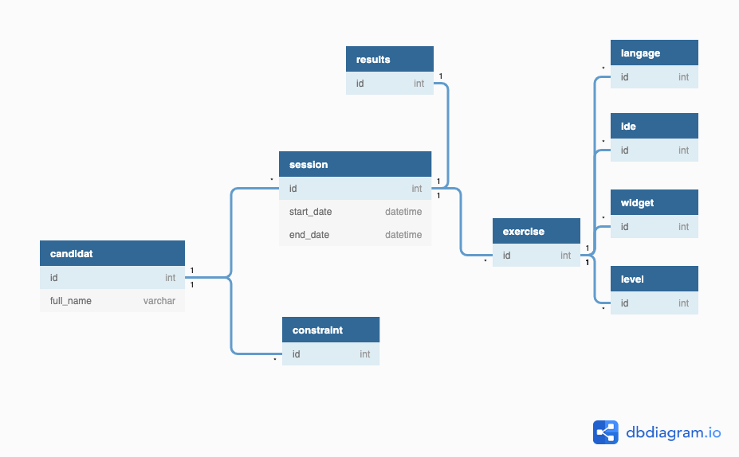

# Diagramme d'entités

# Technologies

## Back-end

Node JS avec Express et base de données PostgreSQL.

PHP Symphony en remplacement.

Utilisation de GraphQL.

## Front-end

React JS (Redux, Apollo, Material-UI, Styled-Components).

VueJS en remplacement.

## Hosting

AWS pour gérer finement les montées en charges (cloud multi-instances).
